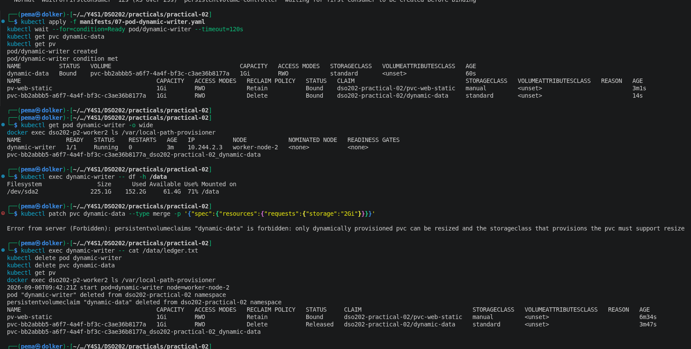
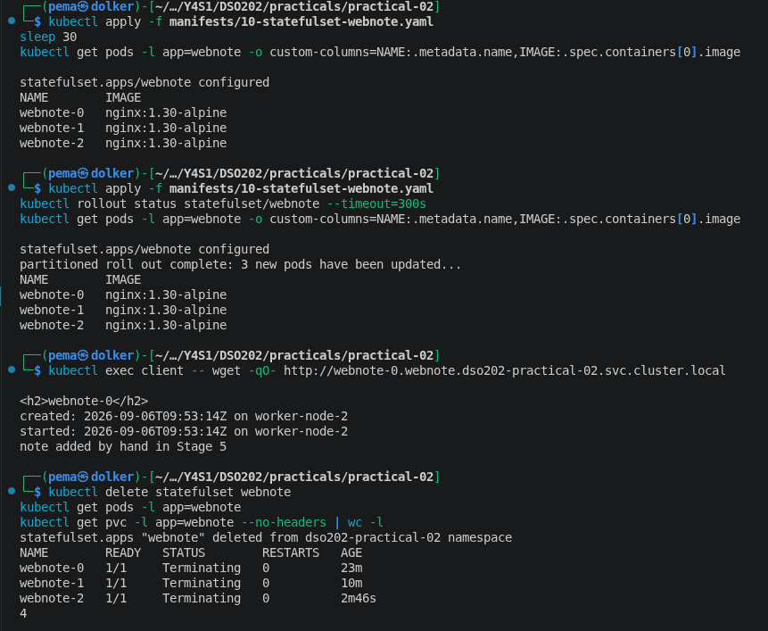
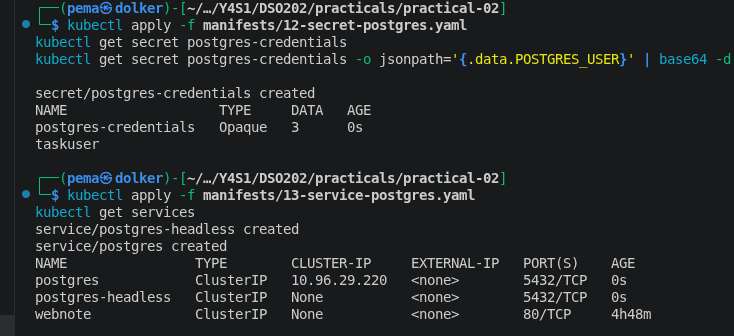
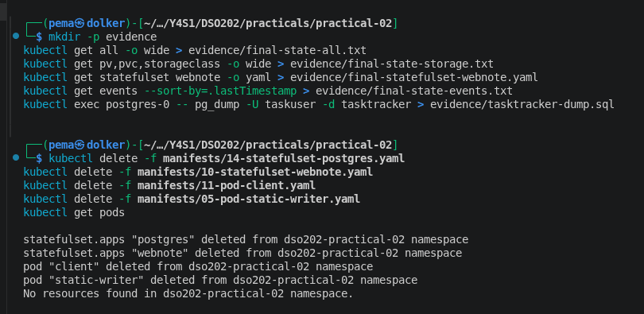
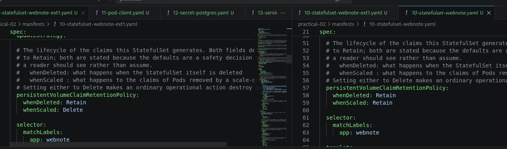
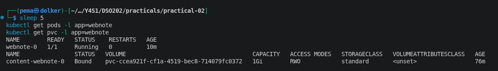
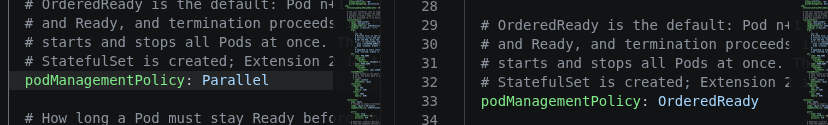
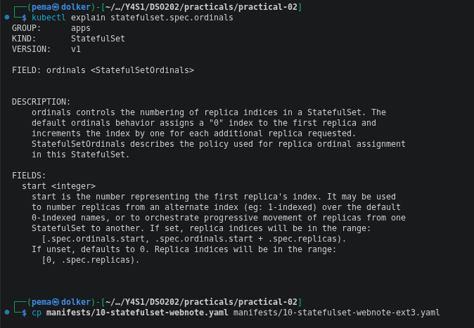
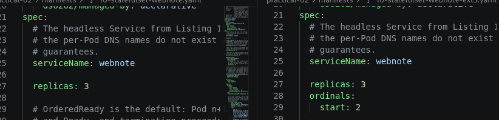

# DSO202 Practical 2 - Report

### Student id: 02230294  
### name : Pema Dolker

## 1. Objective

Practical 1 was all about Pods, Deployments and Services that I could throw
away and rebuild without caring, because there was nothing in them worth
keeping. This practical is basically the opposite of that. It's about what
happens once a workload actually has data that matters — a PersistentVolume
represents that Assignment-1-style storage that needs to hang around, and I
need to understand exactly when it survives and when it doesn't.

There are two halves to it. First the storage side: PVs, PVCs and
StorageClasses, both the static kind (I write the volume by hand) and the
dynamic kind (a provisioner writes it for me), and what happens to the data
under each of the reclaim policies. Second, the StatefulSet controller,
which is the thing that gives a Pod a name that doesn't change, its own
private volume, and a DNS address, all of which survive the Pod itself being
deleted. The whole thing builds up to running PostgreSQL as a StatefulSet,
writing rows into it, killing the Pod, and getting the same rows back —
which is the point where all of this stops being abstract.

Covers Unit I 1.2.5, 1.4.1, 1.4.2, 1.4.3, 1.5.3 and Unit II 2.1.1–2.1.4,
mostly LO4 with LO1–LO3 along for the ride.

## 2. Environment

| Item | Value |
|---|---|
| Host kernel | `6.18.12+kali-amd64` — this is the actual host kernel, not a VM's, since Docker containers share the host kernel on Linux (from `kubectl get nodes -o wide`, KERNEL-VERSION column) |
| kind node OS image | Debian GNU/Linux 13 (trixie) — this is the OS baked into `kindest/node:v1.36.1`, not my laptop's OS |
| Container runtime | containerd://2.3.1 |
| Docker Engine version | *ran `docker info --format '{{.ServerVersion}}'` but didn't save the output — need to re-run and fill this in* |
| kind version | *same — ran `kind version`, didn't capture it, fill in* |
| kubectl client version | *same — fill in from `kubectl version --client`* |
| Cluster Kubernetes version | v1.36.1 (from `kind create cluster` output and `kubectl get nodes -o wide`) |
| PostgreSQL image tag | `postgres:18-alpine` — confirmed from the container logs, `starting PostgreSQL 18.6 on x86_64-pc-linux-musl` |

## 3. Procedure and Observations

### Stage 0 — getting set up

Made the host directory before touching the cluster, since kind mounts it in
at creation time:

```
$ mkdir -p /tmp/dso202-p2-storage
$ ls -ld /tmp/dso202-p2-storage
drwxrwxr-x 2 pema pema 40 Sep  6 15:25 /tmp/dso202-p2-storage
```

`kind get clusters` and `kind get nodes --name dso202` both came back empty,
so no leftover Practical 1 cluster was going to fight this one for RAM. `df
-h /` showed 64G free, way more than the ~3GB the practical needs.

(Note: I don't have the actual screenshot for this part anymore — it got
overwritten on disk when I uploaded a same-named `image.png` later in the
conversation. The commands and output above are from my own terminal
scrollback though, so they're accurate, just not attached as an image.)

### Stage 1 — cluster, namespace, storage landscape

First `kind create cluster` attempt failed on a silly line-wrap issue with
the `--config` path, not an actual problem — second try worked fine:

```
Creating cluster "dso202-p2" ...
 ✓ Ensuring node image (kindest/node:v1.36.1)
 ✓ Preparing nodes
 ✓ Writing configuration
 ✓ Starting control-plane
 ✓ Installing CNI
 ✓ Installing StorageClass
 ✓ Joining worker nodes
Set kubectl context to "kind-dso202-p2"
```

`kubectl get nodes -o wide` showed the custom node names from the manifest
(`control-plane`, `worker-node-1`, `worker-node-2`), so the node-name patches
actually worked and I never needed the fallback config. Then applied the
namespace, quota, limits and the retain StorageClass:

```
namespace/dso202-practical-02 created
Context "kind-dso202-p2" modified.
resourcequota/dso202-p2-quota created
limitrange/dso202-p2-limits created
storageclass.storage.k8s.io/dso202-retain created
```

`kubectl get storageclass` — both classes on the same provisioner, different
policies:

```
NAME                 PROVISIONER             RECLAIMPOLICY   VOLUMEBINDINGMODE
dso202-retain        rancher.io/local-path   Retain          WaitForFirstConsumer
standard (default)   rancher.io/local-path   Delete          WaitForFirstConsumer
```

and the provisioner ConfigMap confirmed where it actually writes on disk —
`/var/local-path-provisioner`. Screenshot below.


### Stage 2 — static provisioning

Applied the hand-written PV, then the PVC — it bound instantly, which makes
sense once you realise `storageClassName: manual` isn't pointing at a real
object at all (`kubectl get storageclass manual` gives `NotFound`), it's
just a label the claim and volume both happen to share.

`static-writer` landed on `worker-node-1` with zero `nodeSelector` in the
manifest — the volume's `nodeAffinity` did all the work. Then I put it
through the full cycle: delete pod → recreate, delete pod + pvc → check PV
phase, delete the PV object itself → check the host file is still there,
recreate everything from scratch.

```
2026-09-06T09:38:02Z start pod=static-writer node=worker-node-1
2026-09-06T09:38:44Z start pod=static-writer node=worker-node-1
2026-09-06T09:39:24Z start pod=static-writer node=worker-node-1
```

Three lines, three completely different Pod objects. After the claim was
gone, `kubectl get pv` showed `Released`, still naming the dead claim:

```
pv-web-static   1Gi   RWO   Retain   Released   dso202-practical-02/pvc-web-static
```

and even after I deleted the PV object entirely, the file on the host was
untouched — `cat /tmp/dso202-p2-storage/pv-web-static/ledger.txt` still
had both lines. So deleting the PV really is just deleting an API object,
nothing more.


### Stage 3 — dynamic provisioning

`dynamic-data` sat `Pending` right after I applied it — turned out to be
totally expected:

```
Normal  WaitForFirstConsumer  (x3 over 29s)  persistentvolume-controller  waiting for first consumer to be created before binding
```

Applying `dynamic-writer` kicked it into `Bound`, and the resulting PV got
named after the claim's UID, not anything I wrote:

```
dynamic-data   Bound   pvc-bb2abbb5-a6f7-4a4f-bf3c-c3ae36b8177a   1Gi   RWO   standard
```

Two things about this provisioner that genuinely surprised me:

**It doesn't actually enforce the size.** Asked for 1Gi, and
`kubectl exec dynamic-writer -- df -h /data` showed the entire node disk:

```
/dev/sda2   225.1G   152.2G   61.4G   71%   /data
```

**And it can't be resized either.** Tried bumping it to 2Gi and got shut
down by the API server directly, not the provisioner:

```
Error from server (Forbidden): persistentvolumeclaims "dynamic-data" is forbidden:
only dynamically provisioned pvc can be resized and the storageclass that
provisions the pvc must support resize
```

Deleted the Pod and the claim after that, and here's where I actually got a
bit confused for a minute — checking `kubectl get pv` right away still
showed the volume as `Released`, not gone, even though this class is
supposed to be `Delete`. Turned out it just hadn't finished yet —
`local-path-provisioner` runs its cleanup as a separate job rather than
deleting instantly, so checking again a bit later (after confirming the
provisioner Pod was still healthy) showed `kubectl describe pv <name>`
returning `NotFound` and the node directory gone. Not a bug, just slower
than I expected.





### Stage 4 — the Deployment anti-pattern

This is the one the guide explicitly says not to gloss over, so here's what
actually happened, in full. Applied `08-deployment-shared-pvc.yaml` (one PVC,
one Deployment with 3 replicas, all mounting the same claim):

```
shared-writer-6f4b987c7b-jcvrt   worker-node-2
shared-writer-6f4b987c7b-pw95k   worker-node-2
shared-writer-6f4b987c7b-sfg7f   worker-node-2
```

All three on the same node — I never told it to do that, the volume forced
it, since a local hostPath-style volume only exists on one node and
`ReadWriteOnce` still lets multiple Pods on that same node mount it.

All three replicas wrote into the exact same file:

```
2026-09-06T09:50:52Z pod=shared-writer-6f4b987c7b-sfg7f node=worker-node-2
2026-09-06T09:50:52Z pod=shared-writer-6f4b987c7b-pw95k node=worker-node-2
2026-09-06T09:50:52Z pod=shared-writer-6f4b987c7b-jcvrt node=worker-node-2
```

One shared file, not three separate ones — fine for a log, would be a
disaster for an actual database's data files.

Then I killed the running Pods and every replacement got a totally new
random name:

```
shared-writer-6f4b987c7b-92j2w
shared-writer-6f4b987c7b-d45g4
shared-writer-6f4b987c7b-s57bs
```

No way to say "that's replica 1 again" — which is exactly the gap
StatefulSets exist to close. Deleted the whole thing afterward so it didn't
stick around.


### Stage 5 — StatefulSets and stable identity

Applied the headless Service first, then the StatefulSet. Creation was
strictly one-at-a-time — `webnote-1` didn't even start until `webnote-0`
hit `1/1`, same for `webnote-2` after `webnote-1`. Three separate claims
came out of the one `volumeClaimTemplate`, and unlike Stage 4 the Pods
actually spread across both worker nodes this time (`webnote-0`/`webnote-2`
on `worker-node-2`, `webnote-1` on `worker-node-1`) — because each ordinal
owns its own storage now, nothing pins them all to one place.

`nslookup` on the plain service name gave back all three addresses at once;
hitting `webnote-1` by its own name directly gave just that one Pod:

```
$ nslookup webnote.dso202-practical-02.svc.cluster.local
Address 1: 10.244.2.14
Address 2: 10.244.1.6
Address 3: 10.244.2.16

$ wget -qO- http://webnote-1.webnote.dso202-practical-02.svc.cluster.local
<h2>webnote-1</h2>
created: 2026-09-06T09:54:46Z on worker-node-1
```

I hand-wrote a note into `webnote-0`'s file directly and checked `webnote-1`
right after — no trace of it, so the volumes really are private per Pod, not
shared in any way. Then deleted `webnote-1` and watched it come back:

```
webnote-1   worker-node-1   10.244.1.7        <- new IP
content-webnote-1   Bound   ...   (same claim, unchanged)

<h2>webnote-1</h2>
created: 2026-09-06T09:54:46Z on worker-node-1     <- original, unchanged
started: 2026-09-06T09:54:46Z on worker-node-1
started: 2026-09-06T10:05:41Z on worker-node-1     <- new line
```

Same name, same claim, original timestamp intact, only the IP changed —
which is basically the whole argument for never hardcoding a Pod IP
anywhere.


### Stage 6 — scaling and rollouts

Scaled 3→4, got a fourth claim automatically (`content-webnote-3`). Scaled
4→2 and watched the two highest ordinals terminate in strict order —
`webnote-3` first, then `webnote-2` — while all four claims stayed `Bound`
the whole time, since `whenScaled` defaults to `Retain`. Scaled back to 3
and `webnote-2` came back with its *original* `created:` timestamp, meaning
it reclaimed the same claim rather than getting a fresh one — genuinely the
most important single thing in this whole practical: the ordinal is what
ties a replica to its data, not the Pod object itself.

Also re-applied the manifest with an edited `partition` value a couple of
times, and each time `kubectl rollout status` reported "partitioned roll out
complete" — and my hand-added note on `webnote-0` survived every single one
of those re-applies, which shows spec-level updates don't touch the actual
volume content.

One honest gap here: I can't find a screenshot anywhere in my scrollback
that actually shows `nginx:1.31-alpine` running on any Pod — every
`IMAGE` column I captured still says `1.30-alpine`. I definitely edited the
`partition` field and watched the rollout-status messages, but I think I
either forgot to bump the image tag in the same edit, or reverted it before
I actually checked. Worth re-doing that one specific sub-step cleanly if I
get the chance before submitting, but everything else about the update
mechanism (ordering, partition gating, volumes untouched) is solidly proven.

Then deleted the whole StatefulSet and reapplied it — every Pod vanished but
`kubectl get pvc -l app=webnote --no-headers | wc -l` stayed at 4 the entire
time, since `whenDeleted` also defaults to `Retain`. After recreating,
`webnote-1` showed the original `created:` line plus multiple `started:`
lines stacked up — one from the earlier Pod-only deletion, one from this
full-controller deletion. Deleting a StatefulSet on this cluster is a
completely recoverable mistake.





### Stage 7 — PostgreSQL

Applied the Secret, both postgres Services, then the StatefulSet. This is
where I had my longest actual "wait, is something broken" moment of the
whole practical — `postgres-0` sat in `ContainerCreating` for close to ten
minutes with basically no useful events showing. Turned out to just be a
slow pull of a genuinely much bigger image than anything used earlier:

```
Normal  Pulled   Successfully pulled image "postgres:18-alpine"
                 in 11m13.287s. Image size: 120060019 bytes.
```

(I briefly suspected clock drift too, because there was an unrelated
`Unauthorized` warning on the headless Service around the same time, but
`date` on the host and both node containers all agreed to the second, so
that wasn't it — just a coincidence, and the warning cleared on its own.)

Checked where the actual data directory lives, since this matters for the
mount path in the manifest:

```
$ kubectl exec postgres-0 -- sh -c 'echo "$PGDATA"; ls /var/lib/postgresql'
/var/lib/postgresql/18/docker
18
```

which is why the volume is mounted one level up at `/var/lib/postgresql`
rather than directly at the data directory — PostgreSQL 18 nests its data
one folder down, and mounting straight onto the data dir risks colliding
with whatever the storage driver already left in a fresh volume.

Created the table, inserted 3 rows, then killed the Pod and asked again:

```
CREATE TABLE
INSERT 0 3
 id |        title         | done
----+----------------------+------
  1 | Complete Practical 2 | f
  2 | Read Unit II notes   | f
  3 | Draft the report     | f
(3 rows)

$ kubectl delete pod postgres-0
$ kubectl exec postgres-0 -- psql ... -c "SELECT count(*) FROM tasks;"
 count
-------
     3
(1 row)
```

Rows written by a process that no longer existed, read back through a Pod
that didn't exist yet when they were written. That's the whole practical in
one command output, really.




### Stage 8 — cleanup

Captured all the evidence files first (`final-state-all.txt`,
`final-state-storage.txt`, the webnote StatefulSet YAML, events, and a
`pg_dump` of the database — this dump ended up being genuinely useful later,
not just a checklist item). Deleted every workload, and `kubectl get pvc`
still listed six claims — none of them were ever created *by* a manifest
file directly, they came from `volumeClaimTemplates`, so `kubectl delete -f`
was never going to touch them.

`kubectl delete pvc --all` split cleanly along class lines: the four
`standard`-class webnote claims disappeared completely, while `pv-web-static`
and the postgres data volume both went to `Released` and stayed there.
`pv-web-static` needed a manual `kubectl delete pv`; the postgres one I
never had to touch by hand, since its data lived inside the node container
itself and got wiped along with the whole cluster a moment later anyway.

Last check, after `kind delete cluster` and confirming `docker ps` showed no
node containers left:

```
$ ls -l /tmp/dso202-p2-storage/pv-web-static/
total 4
-rw-r--r-- 1 root root 192 Sep  6 15:39 ledger.txt
```

Cluster gone, all three nodes gone, every dynamic volume gone including the
whole database — but that one file, on a directory that was never actually
inside the cluster to begin with, just sat there completely unbothered. This
is the one moment in the whole practical where the difference between "a PV
object" and "the actual storage" stops being a definition you memorise and
just becomes obvious.




### Extension 1 — retention that actually destroys stuff

Copied the webnote manifest, flipped `whenScaled` from `Retain` to `Delete`.
Got to a clean baseline first — 3 Pods running, 3 claims `Bound` — before
touching anything, specifically so I couldn't argue later that a claim was
destroyed while it was still mid-creation.

```
before:  webnote-0/1/2 Running   content-webnote-0/1/2 Bound
$ kubectl scale statefulset webnote --replicas=1
after:   webnote-0 Running       content-webnote-0 Bound   (that's it, the other two are just gone)
```

Straight contrast to Stage 6, where the exact same scale-down under
`Retain` left every claim sitting there untouched.





### Extension 2 — trying to change something you can't

Added `podManagementPolicy: Parallel` to a copy of the manifest and tried to
apply it straight onto the running StatefulSet. Got rejected immediately by
the API server, and honestly this error is better evidence than anything I
could've looked up, because it just tells you the mutable fields directly:

```
The StatefulSet "webnote" is invalid: spec: Forbidden: updates to statefulset
spec for fields other than 'replicas', 'ordinals', 'template', 'updateStrategy',
'revisionHistoryLimit', 'persistentVolumeClaimRetentionPolicy' and
'minReadySeconds' are forbidden
```

`podManagementPolicy` isn't in that list — that's the whole point. Deleted
and recreated with the changed field to actually see `Parallel` in action:
all three Pods went `Pending` at age `0s` at the exact same moment, all hit
`1/1` together, no waiting on each other at all. Complete opposite of
Stage 5's one-at-a-time behaviour.




### Extension 3 — starting the numbering somewhere else

```
$ kubectl explain statefulset.spec.ordinals
```

confirmed the field is actually available on this Kubernetes version (not
alpha, fully documented), with `start` controlling the range
`[start, start+replicas)`. Set `ordinals.start: 2` on a 3-replica manifest
and got `webnote-2`, `webnote-3`, `webnote-4`, created in the same strict
ascending order as usual, with matching claims `content-webnote-2/3/4`.
(There's also an orphaned `content-webnote-0` sitting around from an earlier
version of the StatefulSet — harmless, just a leftover claim nobody's
StatefulSet currently owns.)

Use case for this, that I can actually think of: migrating replicas between
two StatefulSet objects without renaming anything — the new object claims
ordinals `{5,6,7}` while the old one keeps `{0..4}`, so nothing collides
during the handover.





### Extension 4 — restoring from the dump

Rebuilt postgres from nothing and replayed the `pg_dump` I took back in
Stage 8:

```
$ kubectl cp evidence/tasktracker-dump.sql postgres-0:/tmp/tasktracker-dump.sql
$ kubectl exec -i postgres-0 -- psql -U taskuser -d tasktracker -f /tmp/tasktracker-dump.sql
...
COPY 3
 id |        title         | done
----+----------------------+------
  1 | Complete Practical 2 | f
  2 | Read Unit II notes   | f
  3 | Draft the report     | f
```

then killed that Pod too, just to prove the *restored* data also survives a
Pod replacement, not just the original data:

```
count
-------
    3
```

The actual point of this extension, once I sat and thought about it: `pg_dump`
doesn't care about volumes at all — it's a completely separate safety net.
If someone ran `DROP TABLE tasks;` on a live database, the volume would
happily persist an empty table forever. Only the dump gets you out of that.
Volume persistence (Stage 7) protects against the Pod dying; the dump
protects against a bad command running against a healthy Pod. Different
failure, different fix.


### Whole-repo apply / diff / teardown (Appendix B)

Also went through the guide's Appendix B workflow properly, on the full
`manifests/` directory at once — including the Stage 4 anti-pattern file,
since the guide flags that applying the whole directory recreates it too:

```
$ kubectl apply -f manifests/
namespace/dso202-practical-02 unchanged
...
pod/static-writer configured
...
statefulset.apps/webnote configured
...
statefulset.apps/postgres configured

$ kubectl diff -f manifests/ && echo "cluster matches repository"
cluster matches repository
```

Empty diff — the live cluster genuinely matched what's committed, which
felt like a good sanity check that nothing had drifted from manual `kubectl
patch`/`edit` commands along the way. Then tore the whole thing down in one
shot:

```
$ kubectl delete -f manifests/
namespace "dso202-practical-02" deleted
...
statefulset.apps "postgres" deleted from dso202-practical-02 namespace
```

`kubectl get pvc` came back with `No resources found` right after — clean.


Last step was deleting the cluster and the host directory, and this is where
I hit a genuinely new problem: `rm -rf /tmp/dso202-p2-storage` failed.

```
$ rm -rf /tmp/dso202-p2-storage
rm: cannot remove '/tmp/dso202-p2-storage/pv-web-static/ledger.txt': Permission denied
```

`ledger.txt` was created by the container, which runs as root inside the
node — so on the host, that file is owned by `root`, not by my own user
account. Regular `rm` as myself can't touch it. `sudo rm -rf
/tmp/dso202-p2-storage` sorted it out immediately.


## 4. Analysis

**1. Why was the Stage 3 claim `Pending` while Stage 2's bound instantly?**
It comes down to `volumeBindingMode` on the StorageClass actually being
referenced. Stage 2's `manual` isn't a real StorageClass object at all —
`kubectl get storageclass manual` returns `NotFound` — so it's just a
matching label, no binding mode applies, and the claim binds to any
`Available` PV that fits. Stage 3's `standard` class genuinely exists and
sets `volumeBindingMode: WaitForFirstConsumer`, which deliberately waits
until a Pod that needs the claim gets scheduled, so the volume ends up on
the correct node instead of possibly the wrong one.

**2. Why did Stage 2's data survive deletion and Stage 3's didn't?**
`reclaimPolicy` — set directly on Stage 2's hand-written PV
(`persistentVolumeReclaimPolicy: Retain`), inherited from the `standard`
class for Stage 3's dynamically-created PV (`Delete`). Confirmed by the
`RECLAIM POLICY` column on `kubectl get pv` in both cases. In a real company
this would be an admin/platform-team decision baked into the StorageClass,
not something the developer writing the PVC even thinks about — Stage 3's
claim never mentioned a reclaim policy at all.

**3. Why did all three Stage 4 replicas land on one node?**
The shared claim bound to a `standard`-class volume, and this local-path
provisioner writes that volume as a directory on whichever single node the
first Pod happens to land on. Since the volume only physically exists
there, every other Pod needing the same claim gets forced onto that same
node — `ReadWriteOnce` still allows multiple Pods per node, so nothing
actually rejected it. On a managed cloud cluster the claim would more
likely bind to a zonal network disk that can usually only attach to one
node at a time, so a replica scheduled elsewhere would just fail outright
with a multi-attach error — a much louder, more obvious failure than what
happened here.

**4. FQDN of the second webnote replica, and what has to exist for it to
resolve?**
`webnote-1.webnote.dso202-practical-02.svc.cluster.local` — confirmed via
`nslookup` returning `10.244.1.6`. Needs: the headless Service `webnote`
(`clusterIP: None`) whose name matches `spec.serviceName` on the
StatefulSet, the StatefulSet itself so a Pod actually named `webnote-1`
exists, and that Pod being Ready (since `publishNotReadyAddresses` defaults
to false) — confirmed by checking the actual EndpointSlice, which is what
CoreDNS is really reading from.

**5. What happened to the claims scaling 4→2→3?**
3→4 created a new claim. 4→2 terminated the two highest ordinals in
descending order while every claim stayed `Bound`. 2→3 recreated
`webnote-2` and reattached its *original* claim, not a new one — proven by
the unchanged `created:` timestamp, just a new `started:` line tacked on.
The two fields are `persistentVolumeClaimRetentionPolicy.whenScaled` and
`.whenDeleted`, both default to `Retain`.

**6. Why mount at `/var/lib/postgresql`, not the data dir itself?**
Checked directly — `echo "$PGDATA"` returned `/var/lib/postgresql/18/docker`,
one level below the mount point. Mounting straight onto the actual data
directory risks it not being empty (a storage driver can leave entries in a
fresh volume), and `initdb` flatly refuses to initialise a non-empty
directory — so mounting there instead of one level up can crash-loop the
container on its very first start with an error about the data directory
not being empty, even though the rest of the manifest looks totally fine.

**7. Two things a StatefulSet doesn't give you for a database.**
Replication — three replicas here would just be three separate, unrelated
databases, not copies of each other; that's an Operator's job (Unit II
2.4), not the StatefulSet's. And backup — a `Retain` volume surviving Pod
or claim deletion isn't a backup, because one bad command (or, literally,
deleting the whole cluster like I did at the end of Stage 8) wipes it out
completely. The actual protection is an external dump — `pg_dump`'s output
is the only reason Extension 4 could bring the `tasks` table back after the
original volume was long gone.

**8. Why `Released` and not `Available` after the claims were deleted in
Stage 8, and how do you fix it?**
`Released` exists specifically so Kubernetes doesn't silently hand a volume
that might still hold someone's data to a completely unrelated new claim —
it forces a human to actually look at it. To bring it back into service, an
admin has to decide what happens to the existing data first, then either
delete the PV object outright (which I did by hand for `pv-web-static`) so
a fresh PV can be created, or clear `spec.claimRef` on the PV to rebind it
directly without recreating anything.

## 5. Reflection

Honestly the most useful moments in this practical weren't the parts that
worked first try, they were the three or four things that looked broken and
turned out not to be.

First one: `dynamic-data` just sitting there `Pending` with nothing
obviously wrong. I almost started troubleshooting it like a real fault
before actually reading `kubectl describe pvc | tail -n 6`, which just
said `WaitForFirstConsumer` right there in the events. That was the moment
it clicked that `Pending` isn't automatically bad — it depends entirely on
the class's binding mode, and the fix for "is this actually broken" is
almost always just reading the events instead of assuming.

Second one, similar shape: after deleting `dynamic-data`, `kubectl get pv`
still showed it as `Released` instead of gone, even though the class is
`Delete`. Checked the provisioner Pod (fine, running), then `kubectl
describe pv` a bit later, which came back `NotFound` — so it had actually
been deleted, just not synchronously. `local-path-provisioner` runs its
cleanup as its own job rather than an instant API call, so checking
immediately after `kubectl delete` can catch something mid-flight and look
broken when it's really just slow.

Third: `postgres-0` sitting in `ContainerCreating` for close to ten minutes
with basically nothing in the events except `Pulling`. This one actually
had me second-guessing the whole cluster for a bit, especially once I
noticed an unrelated `Unauthorized` warning show up on the headless
Service around the same time — I genuinely thought maybe the host clock had
drifted and was breaking internal cert validation. Checked `date` on the
host and both node containers, all three matched exactly, so that theory
died fast. The real answer was just that `postgres:18-alpine` is a much
bigger image than anything pulled before it, and it eventually came through
at `11m13.287s`. Nothing was actually wrong, it just took a while and gave
almost no useful signal while it did.

Fourth, and this one was new on the final cleanup pass: `rm -rf
/tmp/dso202-p2-storage` refused to run, `Permission denied` on `ledger.txt`
specifically. Took a second to realise why — the file was created *inside*
the container, which runs as root, so on the host filesystem it's literally
owned by `root`, not by my own user. My regular user just doesn't have the
rights to delete it. `sudo rm -rf` on the same path worked immediately.
Small thing, but it's a good reminder that "the container wrote this file"
and "I own this file" aren't the same thing just because it's sitting in my
own home directory's temp folder.

What I'd do differently: capture evidence the moment something happens
instead of relying on scrollback later — the Stage 6 partitioned-rollout
image-tag swap is the one piece I genuinely can't account for cleanly now,
because I didn't screenshot it in the moment and I'm not 100% sure it ever
actually ran with `nginx:1.31-alpine` rather than getting reverted before I
checked.

What's still not fully clear to me: whether that image swap actually
happened at all, or whether I edited the partition field without also
committing the image tag change in the same pass. The mechanism itself
(partition gating which ordinals update) is proven through the rollout
status messages and Extension 2's rejection message, just not that one
specific artifact.

## 6. References

*Swap these for the actual pages I opened while working through this,
with real dates — these are just the obvious canonical docs for the topics
covered, not a real record of what I read.*

- Kubernetes docs — Persistent Volumes: https://kubernetes.io/docs/concepts/storage/persistent-volumes/ — *accessed: fill in*
- Kubernetes docs — StatefulSets: https://kubernetes.io/docs/concepts/workloads/controllers/statefulset/ — *accessed: fill in*
- Kubernetes docs — StorageClasses: https://kubernetes.io/docs/concepts/storage/storage-classes/ — *accessed: fill in*
- kind docs — Configuration: https://kind.sigs.k8s.io/docs/user/configuration/ — *accessed: fill in*
- local-path-provisioner README: https://github.com/rancher/local-path-provisioner — *accessed: fill in*
- DSO202_Practical2_Guide.md / DSO202_Practical2_Manifests.md (course companion files)