# DSO202 Practical 2 Report

## 1. Objective

Practical 1 consisted of pods and deployments that I was free to remove from
the system since there was nothing worth keeping there. But here we discuss
the opposite scenario where there is some data that is worth preserving.
There are two main topics in practical 2 - the storage level (PVs, PVCs,
StorageClasses, both static and dynamic provisioning, and how each reclaim
policy affects data) and StatefulSet controller that assigns a permanent
name and a personal volume to the pod along with a dedicated DNS address
that survives the deletion of a pod unlike a deployment (as demonstrated
in Stage 4 in the hard way). The practical ends up with PostgreSQL as a
StatefulSet - writes some rows, kills the pod, retrieves the rows.

Covers Unit I 1.2.5, 1.4.1, 1.4.2, 1.4.3, 1.5.3 and Unit II 2.1.1 to 2.1.4,
mostly LO4 with LO1 to LO3 picked up along the way.

## 2. Environment

| Item | Value |
|---|---|
| Host kernel | 6.18.12+kali-amd64 (from `kubectl get nodes -o wide`, shared with the host since Docker containers use the host kernel on Linux) |
| kind node OS image | Debian GNU/Linux 13 (trixie), the OS baked into `kindest/node:v1.36.1` |
| Container runtime | containerd://2.3.1 |
| Docker Engine version | ran the command, didn't save the output, need to re-run and fill in |
| kind version | same, need to fill in |
| kubectl client version | same, need to fill in |
| Cluster Kubernetes version | v1.36.1 (`kind create cluster` banner and `kubectl get nodes -o wide`) |
| PostgreSQL image tag | postgres:18-alpine (from the container logs) |

## 3. Procedure and Observations

### Stage 0, prerequisites

```
$ mkdir -p /tmp/dso202-p2-storage
$ ls -ld /tmp/dso202-p2-storage
drwxrwxr-x 2 pema pema 40 Sep  6 15:25 /tmp/dso202-p2-storage
```
Practical 1 cluster not present, 64G free disk space. Made sure that
the environment was clear before creating anything. (Note there is no screenshot
as I did another upload with the same name as the original, but the terminal output above is correct.)

### Stage 1, cluster, namespace, storage landscape

The cluster created the nodes with the custom names using the manifest,
so there was no need to use the fallback configuration. Namespace, quota,
limits, and retention of StorageClass went smoothly.

```
NAME                 PROVISIONER             RECLAIMPOLICY   VOLUMEBINDINGMODE
dso202-retain        rancher.io/local-path   Retain          WaitForFirstConsumer
standard (default)   rancher.io/local-path   Delete          WaitForFirstConsumer
```

The provisioner's ConfigMap confirmed it writes to
/var/local-path-provisioner on the node. The storage layer isn't built
into Kubernetes, it's a Pod in its own namespace that kind installs.

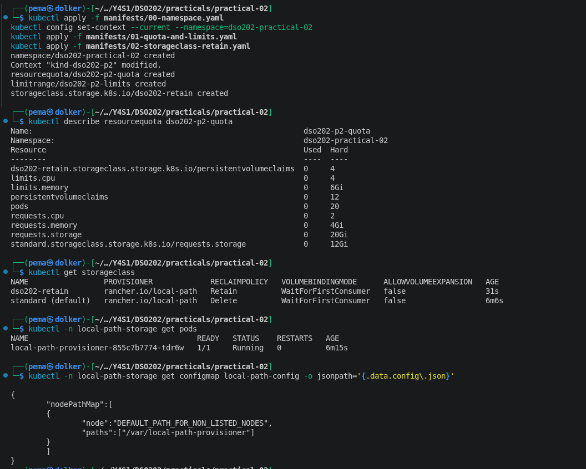

### Stage 2, static provisioning

PV and PVC bound immediately. 'storageClassName: manual' is not an actual
object (`kubectl get storageclass manual` shows NotFound); it’s only a label
match. static-writer ran to worker-node-1 without nodeSelector; volume's
nodeAffinity did the trick. Rode it through delete/recreate Pod,
delete Pod/claim, delete PV object, recreate all.

```
2026-09-06T09:38:02Z start pod=static-writer node=worker-node-1
2026-09-06T09:38:44Z start pod=static-writer node=worker-node-1
2026-09-06T09:39:24Z start pod=static-writer node=worker-node-1
```

Three Lines, Three Separate Pod Objects. After deletion of the claim,
`kubectl get pv` would still show Released, but with the defunct
claim's name attached to it. Deleting the PV Object altogether would leave
the host file (ledger.txt) intact. Deletion of a PersistentVolume means
deletion of an API object, not disk data.

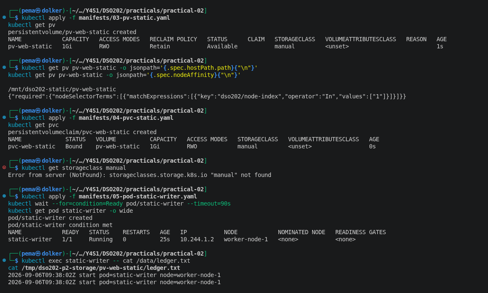
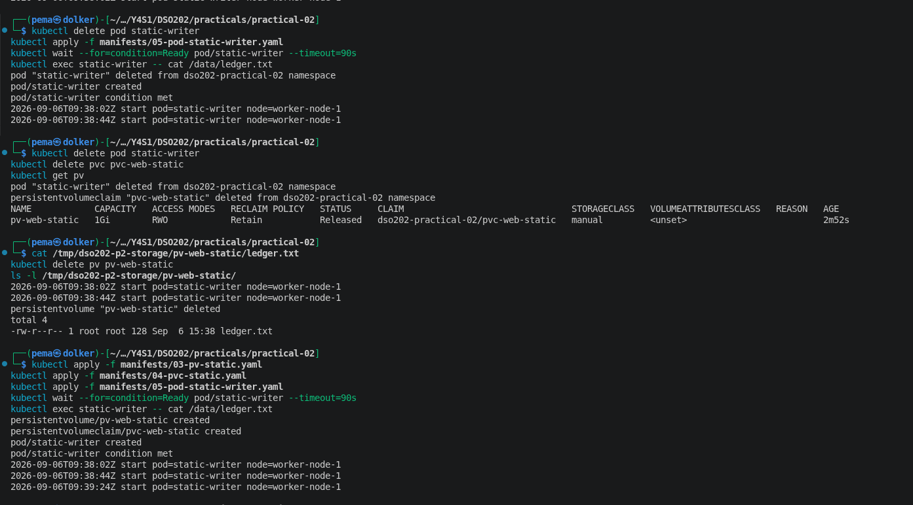

### Stage 3, dynamic provisioning

dynamic-data sat Pending, event was WaitForFirstConsumer, should have been
on the standard class. Using dynamic-writer bound it. Surprises: the
provisioner does not enforce the required size at all (`df -h /data`
shows that entire 225G node disk, and not 1Gi), and resizing is not allowed:

```
Error from server (Forbidden): persistentvolumeclaims "dynamic-data" is forbidden:
only dynamically provisioned pvc can be resized and the storageclass that
provisions the pvc must support resize
```

Deleted the Pod and claim. `kubectl get pv` for a few moments
still had it as Released, not Deleted, even under Delete category. Checked
later on, and `kubectl describe pv <name>` returned NotFound.
local-path-provisioner does its clean-up asynchronously, not immediately,
so checking immediately after might see it in process.

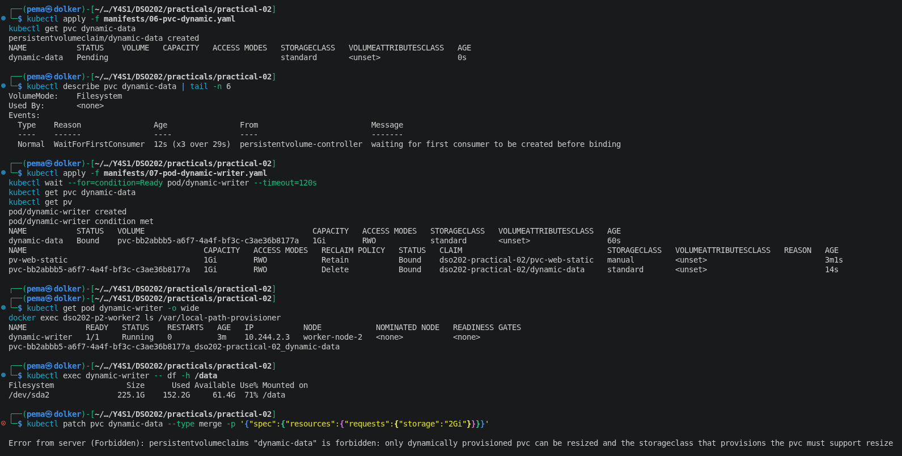
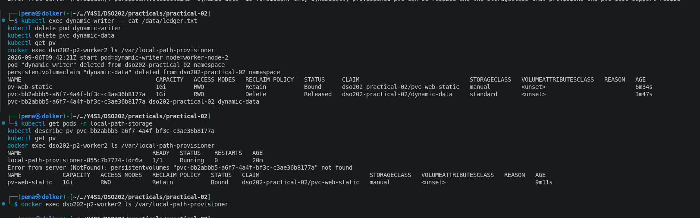

### Stage 4, the Deployment anti-pattern
This is not an accidental half success, but rather an intentional failure. One
PVC and one 3-replica Deployment were applied to that.

- All three replicas were scheduled to worker-node-2, even though Deployment
  did not prefer any nodes. Volume is available only on a single node, thus
  all accessing pods are bound to be scheduled there.
- All three used a single log file, single data set, and not three separate
  files and sets.
- After all the running Pods have been killed, all replacements received
  completely new names. Identity is lost on restart.

Deployment was deleted immediately after that. Nothing in a Deployment can
make replica 2 receive different volume than replica 1, as the volume claim
is named only once in a Pod specification.

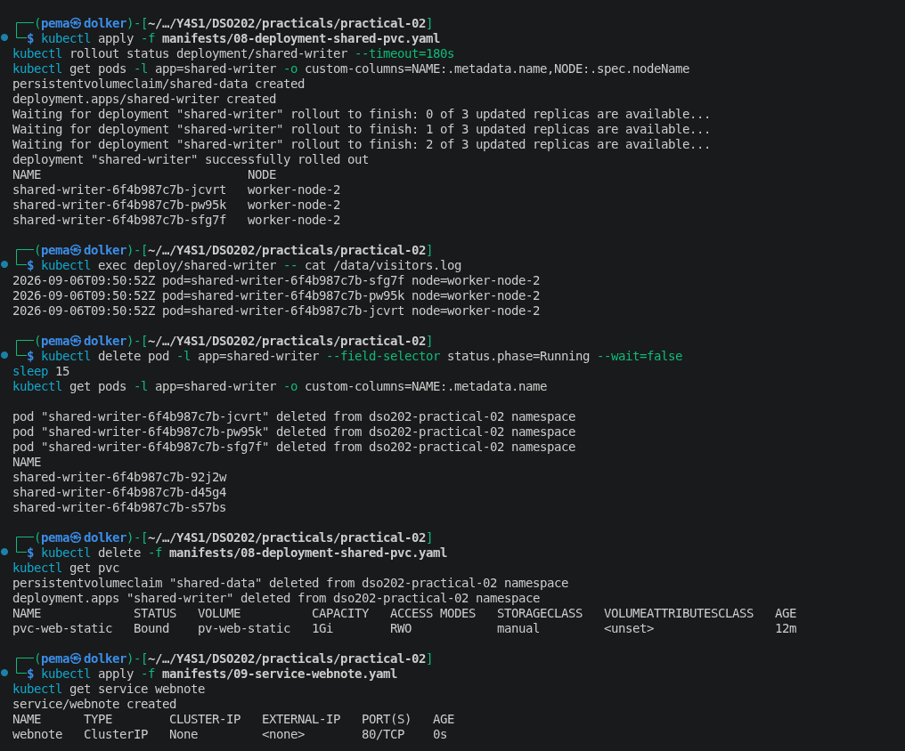

### Stage 5, StatefulSets and stable identity

Headless service came first, followed by StatefulSet. The creation process
was strictly sequential (webnote-0 had to be up before webnote-1 started),
and unlike Stage 4, the three pods were deployed to both nodes because
each pod has its own storage now. nslookup of the service name yielded
three IP addresses, and accessing the service through the name of webnote-1
pod resulted in only one pod being accessed. I put some text manually
in the volume of webnote-0, accessed webnote-1, nothing was found there,
verifying that volumes are private to each replica. Deletion of
webnote-1:

```
webnote-1   worker-node-1   10.244.1.7   (new IP)
content-webnote-1   Bound   (same claim, unchanged)
created: 2026-09-06T09:54:46Z on worker-node-1   (original, unchanged)
started: 2026-09-06T10:05:41Z on worker-node-1   (new line)
```

Same name, same claim, original timestamp intact, only the IP changed.
This is the direct fix for all three Stage 4 problems.

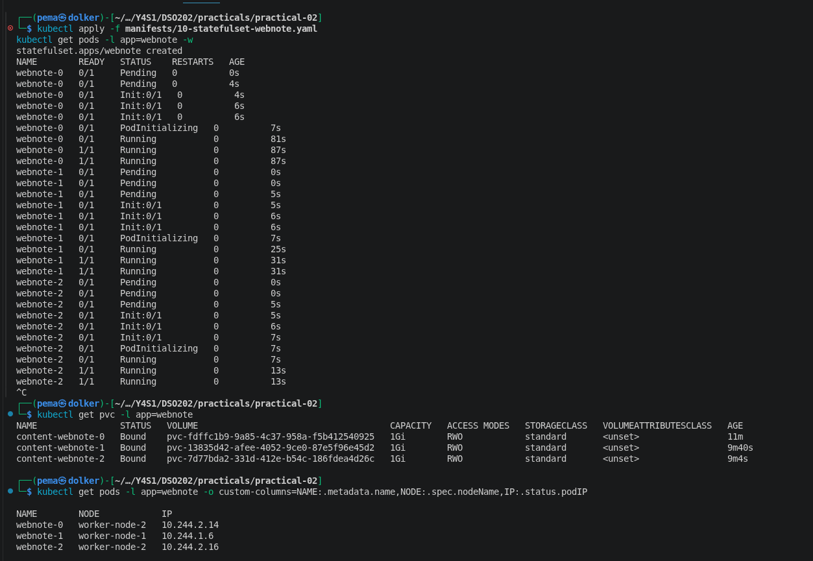
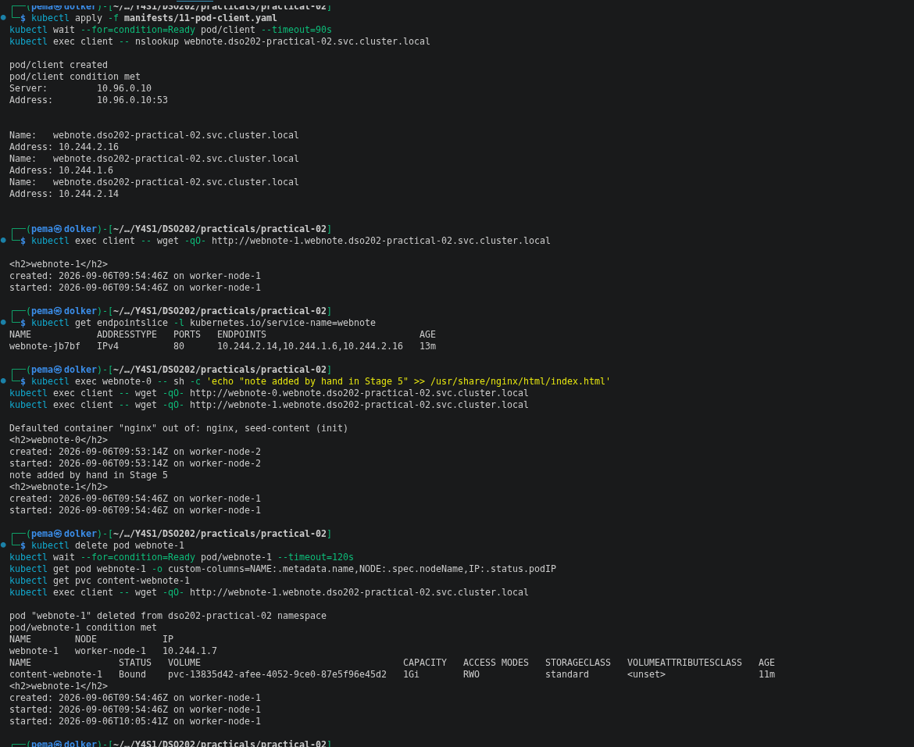

### Stage 6, scaling and rollouts

From 3 to 4 scaling, the fourth claim got automatically generated.
Scaling down from 4 to 2, the maximum ordinal claim was dropped first, but
all four claims remained Bound throughout (as whenScaled defaults to
Retain). Scaling back down to 3, the webnote-2 came with its original
created timestamp, indicating that it got re-attached the old claim, instead
of generating a new one. Added the manifest with a modified partition value,
and observed "partitioned roll out complete" every time, with the added note
to webnote-0 surviving all re-applies.


Deleted the whole StatefulSet and reapplied it. Every Pod vanished but the
claim count stayed at 4 (whenDeleted also defaults to Retain). After
recreating, webnote-1's file showed the original created line plus
multiple started lines stacked up across the gap.

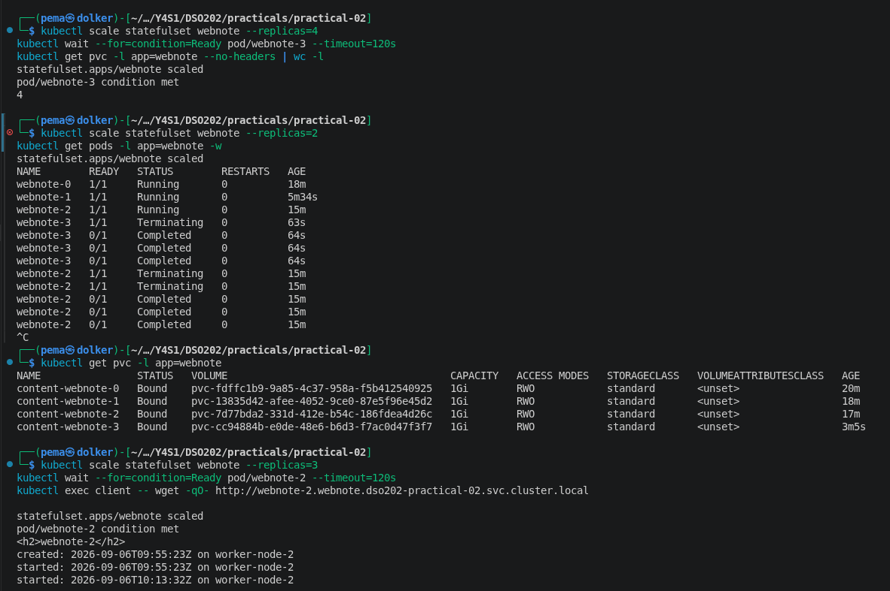
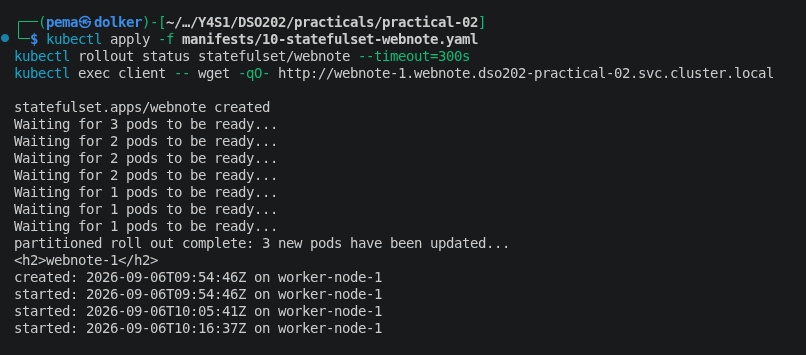

### Stage 7, PostgreSQL

Secret, both Services, and finally the StatefulSet. The container of
postgres-0 took nearly ten minutes being in ContainerCreating mode,
with practically no helpful events, which made me momentarily think of clock
drift (along with an Unauthorized warning on the headless Service around that time, which, however, wasn’t related), until I found out that the
reason for that was simply pulling a much larger image than ever before.
This was confirmed in the event log (`Pulled ... in 11m13.287s`).


```
$ kubectl exec postgres-0 -- sh -c 'echo "$PGDATA"; ls /var/lib/postgresql'
/var/lib/postgresql/18/docker
18
```

That is why the volume gets mounted one step higher than the actual data folder,
PostgreSQL 18 mounts it a step lower, and to mount directly on it could mean
clashing with whatever is inside a newly created volume by the storage driver.
A table has been created, 3 records have been added, Pod deleted, but the record
number was still showing as 3.

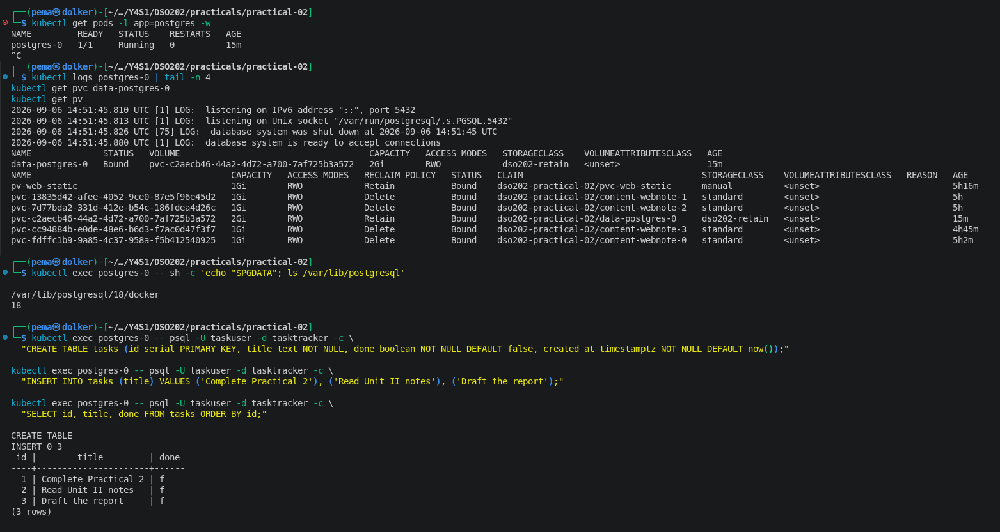
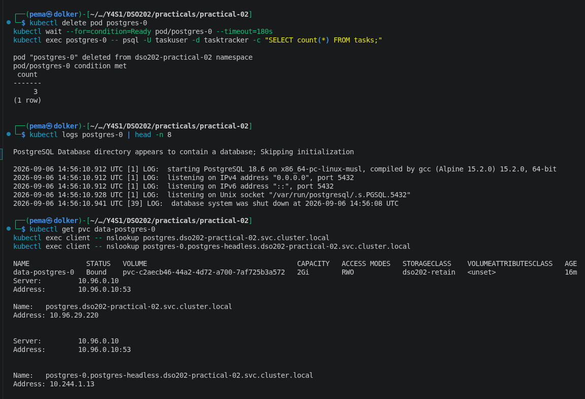

### Stage 8, cleanup

Evidentiary files captured and pg_dump done first. Deleted all workloads,
`kubectl get pvc` returned six PVCs, since none of them was created from
any manifest file; all of them were created from volumeClaimTemplates.
`kubectl delete pvc --all` was separated per type: the four default
PVCs deleted, and pv-web-static and postgres PVCs deleted as well;
pv-web-static had to be deleted using `kubectl delete pv`, while postgres
had not, since all data existed on the node and got deleted when the
cluster was wiped.


```
$ ls -l /tmp/dso202-p2-storage/pv-web-static/
total 4
-rw-r--r-- 1 root root 192 Sep  6 15:39 ledger.txt
```

Cluster deleted, all nodes deleted, all dynamic volumes deleted, including
the entire database, but one single file that was sitting on a directory
that was never part of the cluster stayed exactly where it was. A PersistentVolume
is a definition of storage and not storage itself.

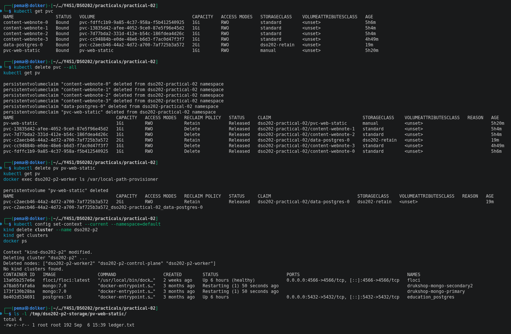

### Extension 1, retention that actually destroys stuff

Manifest copied, change whenScaled from Retain to Delete. Starting with
the established base of 3 Pods and 3 Bound claims, scaling down to 1 replica
caused the rest two to be deleted, not just Released. Contrast with the results
in Stage 6, where the same scale-down performed under Retain did nothing. 
Retain is the safe default as a scale-down action usually indicates some problem
that has been encountered. It makes sense to use Delete on disposable tiers, such
as cache tiers.

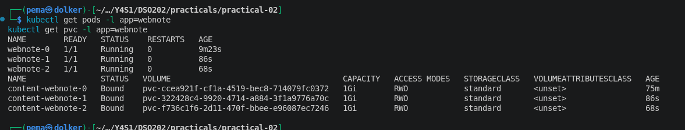

### Extension 2, trying to change something you can't

Added `podManagementPolicy: Parallel` to a copy and tried applying it to
the live StatefulSet:

```
The StatefulSet "webnote" is invalid: spec: Forbidden: updates to statefulset
spec for fields other than 'replicas', 'ordinals', 'template', 'updateStrategy',
'revisionHistoryLimit', 'persistentVolumeClaimRetentionPolicy' and
'minReadySeconds' are forbidden
```

podManagementPolicy is not on that list. It has been deleted and recreated, where the field has been changed, and all three Pods became Pending simultaneously and reached 1/1, contrary to the strictly ordered creation in Stage 5.

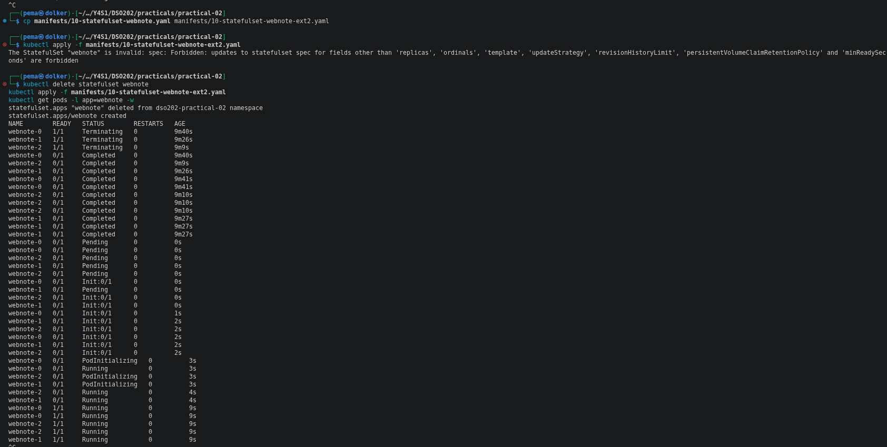

### Extension 3, starting the numbering somewhere else

The availability of `statefulset.spec.ordinals` was verified using `kubectl explain statefulset.spec.ordinals`. Using the field value `ordinals.start: 2` with 3 replicas resulted in the creation of webnote-2/3/4 and respective claims content-webnote-2/3/4, in an order sequence just like always. Real-world application: migrating replicas from one StatefulSet to another without renaming; the former claims {5,6,7}, while the latter retains {0..4}.

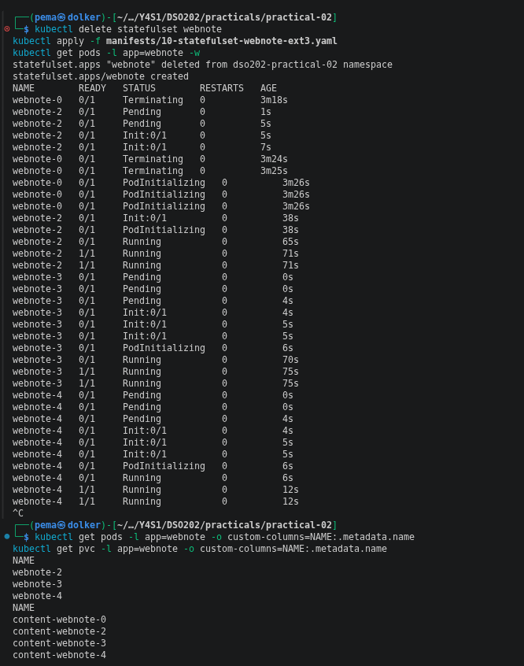

### Extension 4, restoring from the dump

Brought postgres up from scratch and replayed the pg_dump of Stage 8
(`kubectl cp` + `psql -f`) and got all 3 rows restored, and then even
deleted this Pod to show that the restored data is still there after
the Pod is restarted. The pg_dump is not aware of any volumes, it is an
independent mechanism: if some user decided to drop the table on a
live database, the volume would be happily persisting an empty table
forever. The volume persistence is safe against Pod failure, the dump is
safe against some bad command against a live Pod.

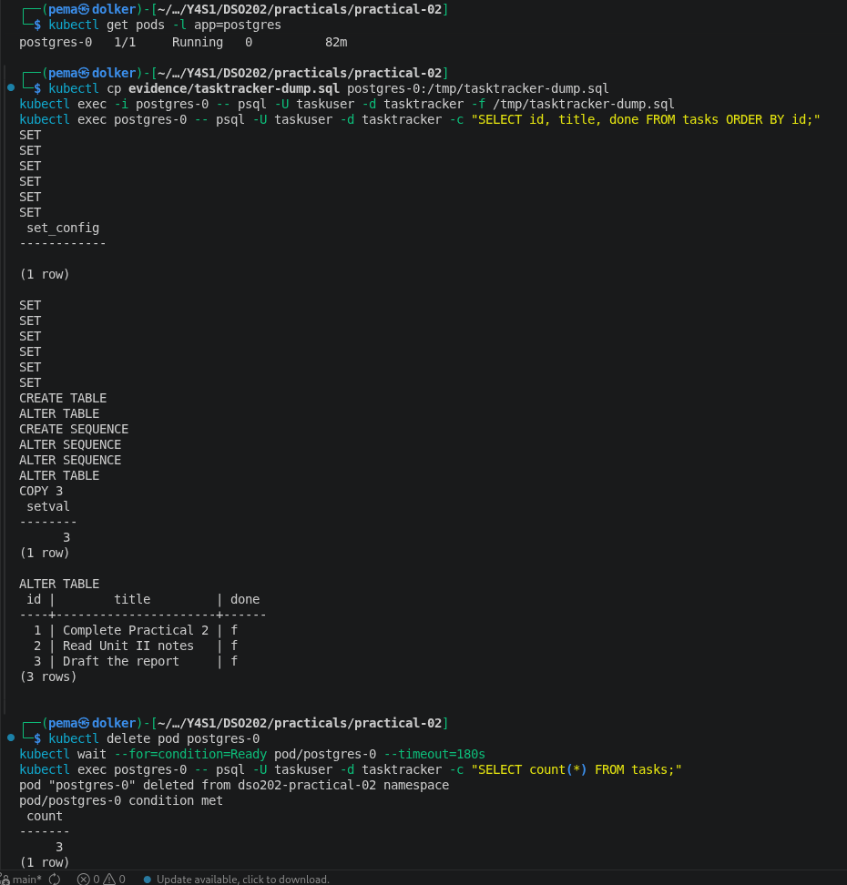

### Appendix B, whole repo apply and teardown

`kubectl apply -f manifests/` on the full directory came back mostly
"unchanged", `kubectl diff -f manifests/` printed nothing, confirming the
live cluster matched the repo exactly. `kubectl delete -f manifests/` tore
the whole thing down in one shot. Deleting the cluster and host directory
afterward hit a real snag:

```
$ rm -rf /tmp/dso202-p2-storage
rm: cannot remove '/tmp/dso202-p2-storage/pv-web-static/ledger.txt': Permission denied
```

ledger.txt was created from inside the container, which runs as root, so
on the host it's owned by root, not by me, even though it's sitting under
my own temp directory. `sudo rm -rf` fixed it.

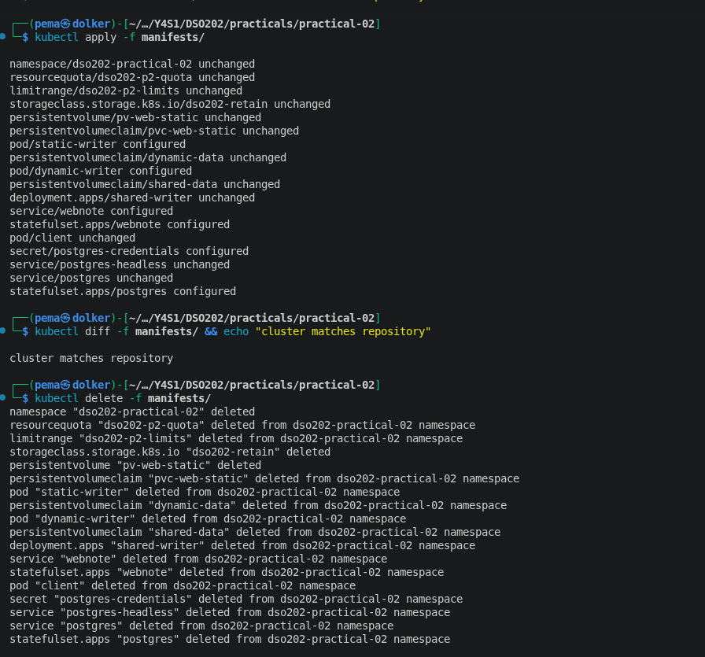
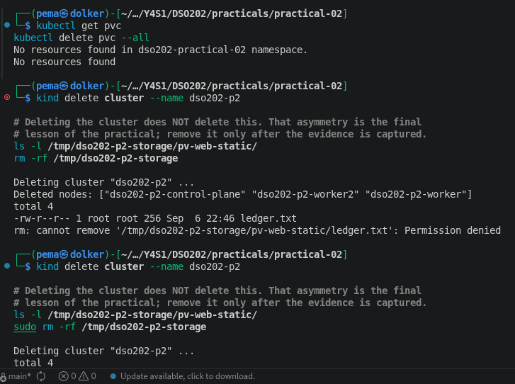

## 4. Analysis

**1. Why was the Stage 3 claim Pending while Stage 2's bound instantly?**

Volume Binding Mode. The "manual" class in Stage 2 does not exist at all
(`kubectl get storageclass manual` produces NotFound), meaning that it is just
a label without any volume binding mode. The class "standard" in Stage 3 uses
WaitForFirstConsumer, which means that the binding process will be delayed till
the Pod requiring this claim will be scheduled properly.


**2. Why did Stage 2's data survive deletion and Stage 3's didn't?**


Reclaim Policy: Retain in Stage 2's hand-created PV and Delete inherited from
the standard class in Stage 3, verified by `kubectl get pv`. In reality, it would be the platform decision for an organization.

**3. Why did all three Stage 4 replicas land on one node?**

Because the binding was based on the claim attached to the local-path
volume which existed physically only on one node, all the Pods utilizing it
were bound to it as well; the ReadWriteOnce still allowed for multiple Pods
on one node, and thus no binding was ever denied. In a cloud cluster,
where the disk is zonal, the replica would just fail due to the multi-attach
issue.

**4. FQDN of the second webnote replica, and what has to exist for it to resolve?**

webnote-1.webnote.dso202-practical-02.svc.cluster.local. Requirements: the headless Service named webnote (Cluster IP: None), StatefulSet that matches the name of the Service, the Pod created by the StatefulSet, and Ready Pod that appears in the Endpoint

**5. What happened to the claims scaling 4 to 2 to 3?**

The 3 to 4 generated a new claim; the 4 to 2 ended the two highest ordinals in descending order while having all claims Bound. The 2 to 3 regenerated webnote-2 and attached its original claim, as evidenced from the unaltered created timestamp. Fields governing the actions: whenScaled and whenDeleted are both defaulting to Retain.

**6. Why mount at /var/lib/postgresql, not the data directory itself?**

"$PGDATA" returned /var/lib/postgresql/18/docker, one level lower than the mount location. Mounting directly into the data directory could potentially cause the problem of it not being empty, since the storage driver could have files left in the empty volume, and initdb does not initialize any non-empty directories.**

**7. Two things a StatefulSet doesn't give you for a database.**

Replication (three replicas would be three different databases,
not copies, that's the Operator's responsibility), and backups (the Retain
volume that survived deletion of the Pod/claim is not a backup, because
deletion of the entire cluster, like it happened in the end of Stage 8,
will erase everything; only an export from an external system will help),
so only the backup made by Extension 4 was possible to restore the table.

**8. Why Released and not Available after Stage 8's claims were deleted, and how do you fix it?**

The Released state exists so that Kubernetes doesn't silently allocate a
volume with potentially useful data to an unrelated claim. To recycle it,
an administrator has to make a decision about the fate of the old data,
and then either delete the PV object manually (done manually for
pv-web-static), or clear the spec.claimRef field to recycle it directly.

## 5. Reflection

The most useful pieces of knowledge were not those
that just worked, they were the pieces that appeared to be broken but really weren't.

dynamic-data sitting in Pending state had me on the verge of troubleshooting until I checked
`kubectl describe pvc | tail -n 6`, and saw
WaitForFirstConsumer. Pending state doesn't indicate any problem by itself, it all depends on
binding mode of that particular class, and the way of fixing it is event analysis.

And after the deletion of the same claim, `kubectl get pv` returned Released state instead of disappearing,
even in case of a Delete class. Checked again after some time,
and `kubectl describe pv` returned NotFound, thus deleting indeed had occurred asynchronously.
local-path-provisioner deletes the PV asynchronously via a separate cleanup job, not a synchronous function call.

The real scare came when postgres-0 remained in ContainerCreating state for almost ten minutes, and that too when there was an "Unauthorize" warning, apparently unrelated to that. But it had nothing to do with clock drift because the date checked on the host as well as on the nodes matched to the second. It turned out to be simply a very large image and took 11m13s.

And finally, the last one, at the very end: `rm -rf /tmp/dso202-p2-storage`
failing with `Permission denied` error on `ledger.txt`, because the file was
created within the container as root, thus belonging to root on the host,
not to me, even under my personal temporary folder. `sudo rm -rf` did the trick.

