# DSO202 Practical 5: Environment-Specific Configuration with Kustomize on kind


## 1. Objective

The aim of this practical was to run the same small nginx web app in three environments (dev, staging and prod) without keeping three copies of the Deployment and the Service. Kustomize does this with one base that holds the shared resources, and one overlay per environment that only holds what is different.

I rendered the base and the overlays without touching the cluster, compared dev with prod, and deployed with `kubectl apply -k` using the order render, diff, apply, verify. Then I changed the dev web page to see how a change in a generated ConfigMap turns into a rollout of the Deployment. At the end I wrote my own QA overlay that uses a JSON 6902 patch, and deleted all the environments.

## 2. Environment

| Item | Value |
|---|---|
| Operating system | Kali GNU/Linux Rolling |
| Docker | 29.3.1 |
| kind | v0.32.0 (go1.26.3, linux/amd64) |
| kubectl (client) | v1.36.0 |
| Kustomize | v5.8.1, built into kubectl |
| Cluster | kind cluster `dso202-assignment`, Kubernetes v1.36.1 |
| Container runtime | containerd 2.3.1 |
| Nodes | 1 (`dso202-assignment-control-plane`) |

The lab diagram shows a control-plane and two workers, but my cluster only has the control-plane node. It has no taint (`Taints: <none>`), so pods can be scheduled on it, and because of this every pod in this practical ran on the same node. It does not change what Kustomize renders.

The cluster was already 5 days old when I started, so I reused it instead of creating a new one. The practical only created and deleted the `webapp-*` namespaces. The other namespaces on the cluster (`dso202-assignment-01`, `ingress-nginx`) were not touched.

## 3. Procedure and Observations

### Task 0: Pre-flight

I ran `kubectl cluster-info`, `kubectl get nodes -o wide` and `kubectl version --client -o yaml`. I also checked the node taints with `kubectl describe node dso202-assignment-control-plane | grep -i taints` and listed the namespaces with `kubectl get ns` to make sure no `webapp-*` namespace existed yet.


The output shows that kubectl reaches the kind cluster on `127.0.0.1:38035`, the node is `Ready`, and `kustomizeVersion: v5.8.1` is printed, so `-k` and `kubectl kustomize` are available. The taints line was `<none>` and there was no `webapp-*` namespace.

### Task 1: Read the repository

I listed the repository with `tree examples/webapp` and read the base and the dev and prod `kustomization.yaml` files before running anything.

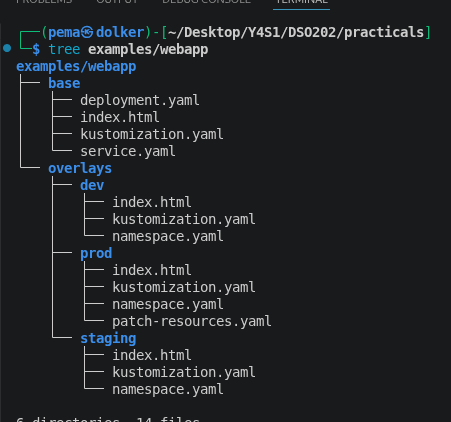

```text
examples/webapp/
├── base/
│   ├── deployment.yaml
│   ├── index.html
│   ├── kustomization.yaml
│   └── service.yaml
└── overlays/
    ├── dev/
    │   ├── index.html
    │   ├── kustomization.yaml
    │   └── namespace.yaml
    ├── prod/
    │   ├── index.html
    │   ├── kustomization.yaml
    │   ├── namespace.yaml
    │   └── patch-resources.yaml
    └── staging/
        ├── index.html
        ├── kustomization.yaml
        └── namespace.yaml
```

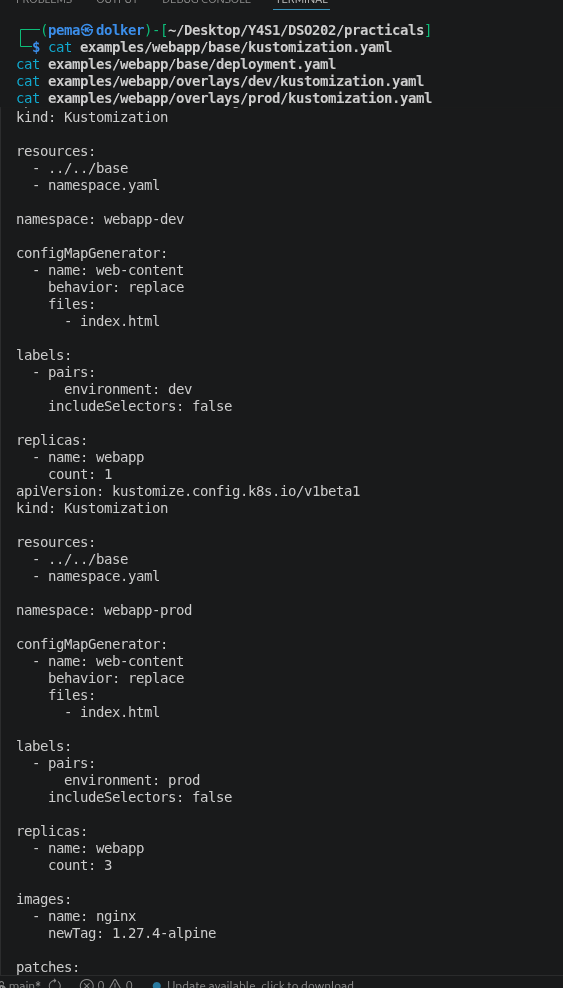

The tree shows one Deployment and one Service in `base/`, and only small files in each overlay. The answers to the three questions of this task are in section 4.

### Task 2: Render the base

I rendered the base with `kubectl kustomize examples/webapp/base` and used the two `grep` filters from the lab. I did not apply it.

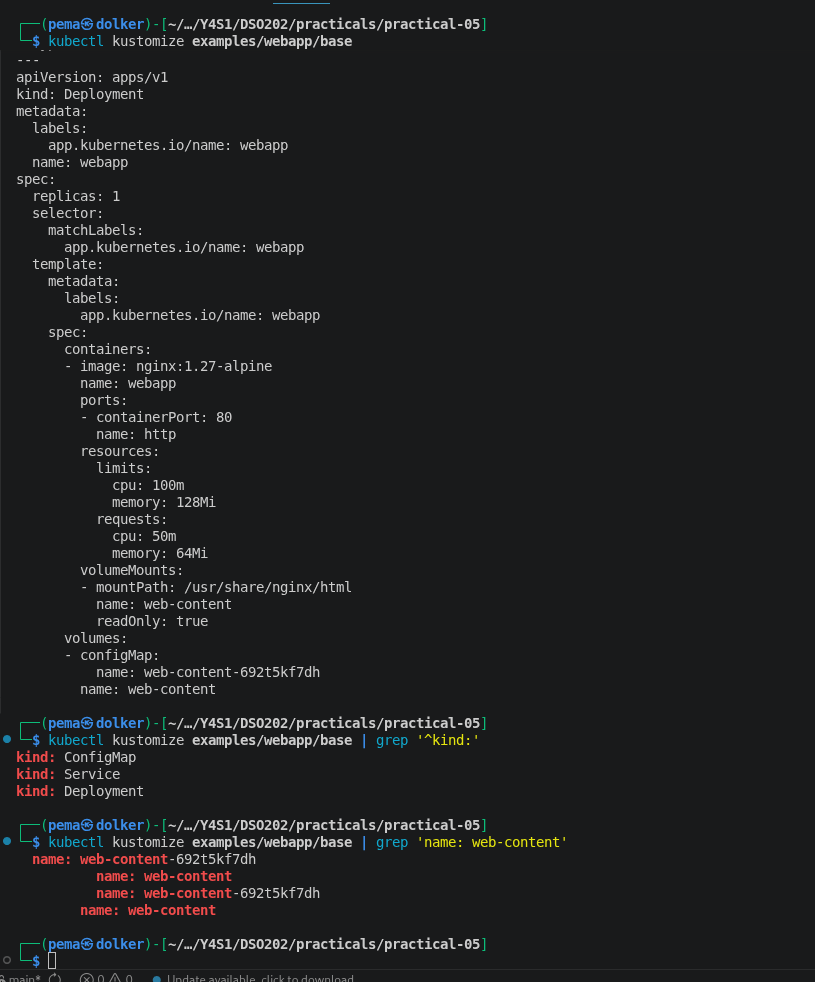

The render has three objects (ConfigMap, Service, Deployment). The generated ConfigMap is called `web-content-692t5kf7dh`, and the Deployment's `volumes[].configMap.name` was rewritten to the same name. The empty `{}` selectors in `deployment.yaml` and `service.yaml` are filled in now: `app.kubernetes.io/name: webapp` is in the Deployment selector, the pod template labels and the Service selector. The `grep 'name: web-content'` command gave four lines, and only two of them have the hash (the ConfigMap's own name and the Deployment's `configMap.name`).

### Task 3: Compare dev and prod

I rendered both overlays to `/tmp` with `kubectl kustomize`, and compared them with `diff -u`. The diff is long, so I also saved it to `evidence/task3-dev-vs-prod.diff`.

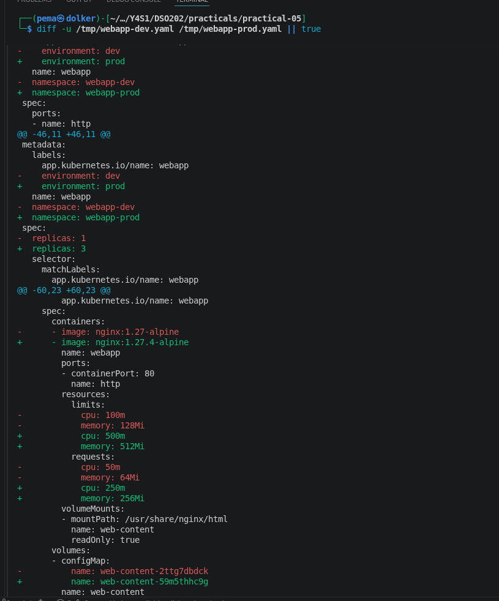

| # | Difference | dev | prod | Where it is defined |
|---|---|---|---|---|
| 1 | Namespace | `webapp-dev` | `webapp-prod` | `namespace:` in each overlay's `kustomization.yaml`, and `namespace.yaml` |
| 2 | Environment label | `environment: dev` | `environment: prod` | `labels:` block of the overlay |
| 3 | Replicas | 1 | 3 | `replicas:` block |
| 4 | Image | `nginx:1.27-alpine` | `nginx:1.27.4-alpine` | `images:` block, prod only |
| 5 | Resources | requests 50m / 64Mi, limits 100m / 128Mi | requests 250m / 256Mi, limits 500m / 512Mi | `patch-resources.yaml`, prod only |
| 6 | Web page | DEV page | PROD page | each overlay's `index.html` |

The ConfigMap name also differs (`web-content-2ttg7dbdck` and `web-content-59m5thhc9g`), but I did not count it as a seventh difference, because it only changes as a result of difference 6. None of the two overlays sets an annotation.

One more thing I saw in the diff is that the pod template labels only contain `app.kubernetes.io/name: webapp`. The `environment` label is on the Namespace, ConfigMap, Service and Deployment, but not on the pods, so `kubectl get pods -l environment=dev` would return nothing.

### Task 4: Deploy dev

I rendered dev, ran `kubectl diff -k`, then `kubectl apply -k`, and verified with `kubectl get all -n webapp-dev`, `kubectl get configmap -n webapp-dev` and `kubectl rollout status`.

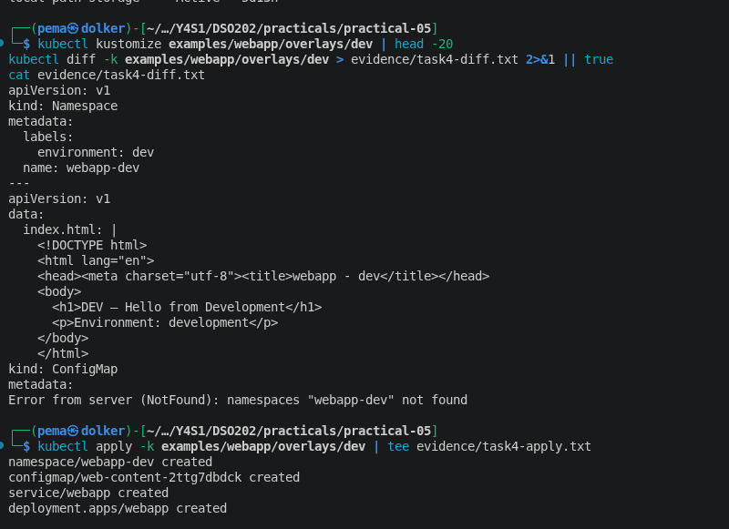

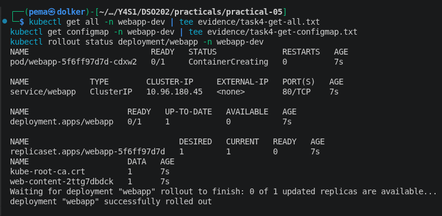

The diff printed only `Error from server (NotFound): namespaces "webapp-dev" not found`, because the namespace did not exist yet. The apply created four objects: the Namespace, `configmap/web-content-2ttg7dbdck`, `service/webapp` and `deployment.apps/webapp`. In the first listing the pod `webapp-5f6ff97d7d-cdxw2` was still `ContainerCreating`, then `rollout status` reported that the deployment was successfully rolled out. The pod shows `1/1 Running` in the Task 6 "before" screenshot. The Deployment keeps the name `webapp`, and the namespace is what separates the environments.

### Task 5: Reach the application

I ran `kubectl port-forward -n webapp-dev service/webapp 8080:80` in one terminal and `curl http://127.0.0.1:8080` in another.

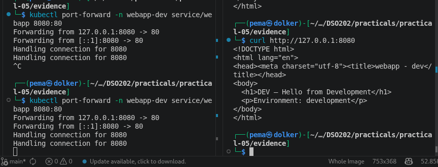

The response is the HTML page with `DEV — Hello from Development` and `Environment: development`, so the page from `overlays/dev/index.html` reaches nginx through the generated ConfigMap.

### Task 6: ConfigMap hash and rollout

First I saved the current state. Then I changed the heading in `overlays/dev/index.html` to `DEV v2 — configuration changed`, rendered again before applying, applied, and looked at the result.

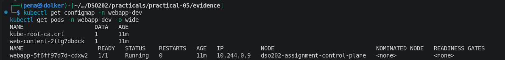

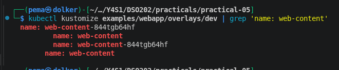

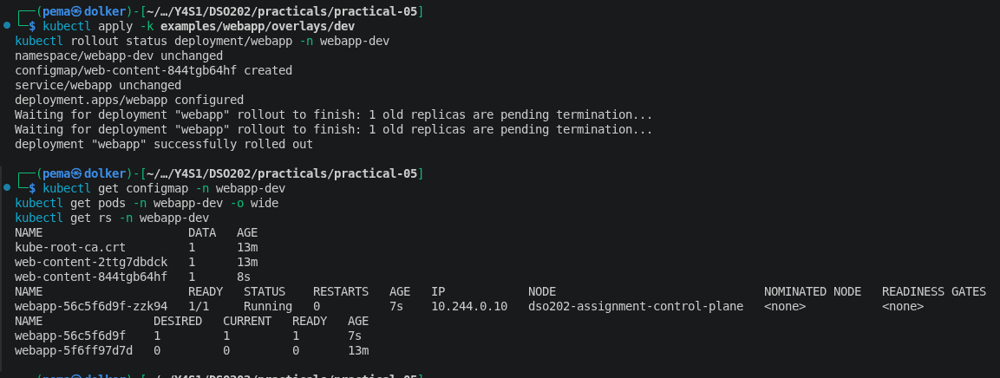

| | Before the edit | After the apply |
|---|---|---|
| ConfigMap | `web-content-2ttg7dbdck` | `web-content-844tgb64hf` (the old one was still listed) |
| Pod | `webapp-5f6ff97d7d-cdxw2` | `webapp-56c5f6d9f-zzk94` |
| ReplicaSet | `webapp-5f6ff97d7d`, 1 pod | `webapp-56c5f6d9f`, 1 pod (the old one is at 0) |

In the apply output the new ConfigMap was `created`, the Deployment was `configured`, and the Namespace and Service were `unchanged`. My explanation of the chain is in section 4.

### Task 7: Staging and prod

For staging and prod I used the same order, diff and then apply, and then checked all namespaces with the label query from the lab.

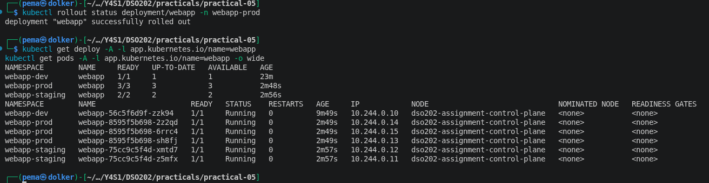

| Namespace | Replicas | Ready |
|---|---|---|
| `webapp-dev` | 1 | 1/1 |
| `webapp-staging` | 2 | 2/2 |
| `webapp-prod` | 3 | 3/3 |

One label query found the Deployments and pods of all three environments, because the base puts `app.kubernetes.io/name: webapp` on everything. All six pods are on `dso202-assignment-control-plane`, since there is only one node. Right after the apply the prod pods were still `ContainerCreating` (0/3), while staging was already running. I think this is because prod uses a different image tag (`1.27.4-alpine`) that had to be pulled first. I waited with `kubectl rollout status deployment/webapp -n webapp-prod` and it finished with 3/3.

### Task 8: The prod patch

I read `overlays/prod/patch-resources.yaml`, rendered prod, and then checked the live Deployment with `jsonpath`.

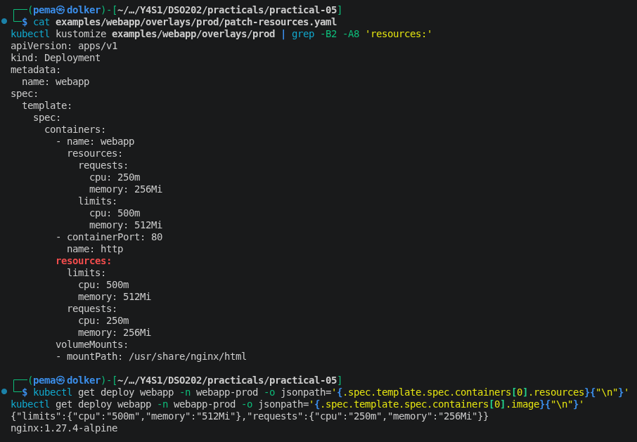

The patch, the render and the live Deployment all show requests of 250m CPU and 256Mi memory, and limits of 500m CPU and 512Mi memory. The live image is `nginx:1.27.4-alpine`, which comes from the `images:` block and not from the patch. The three questions of this task are answered in section 4.

### Task 9: QA overlay

I created `overlays/qa/` with four files and no copy of `deployment.yaml` or `service.yaml`. I started from the dev files and changed the namespace to `webapp-qa`, the label to `environment: qa` and the replicas to 2. The page in `index.html` is my own QA text.

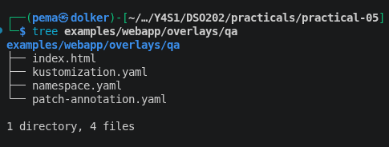

`overlays/qa/kustomization.yaml`:

```yaml
apiVersion: kustomize.config.k8s.io/v1beta1
kind: Kustomization

resources:
  - ../../base
  - namespace.yaml

namespace: webapp-qa

configMapGenerator:
  - name: web-content
    behavior: replace
    files:
      - index.html

labels:
  - pairs:
      environment: qa
    includeSelectors: false

replicas:
  - name: webapp
    count: 2

patches:
  - path: patch-annotation.yaml
    target:
      kind: Deployment
      name: webapp
```

`overlays/qa/patch-annotation.yaml`:

```yaml
- op: add
  path: /metadata/annotations/training.example.com~1owner
  value: qa-team
```

I rendered the overlay first and did not apply until the annotation showed up in the Deployment.

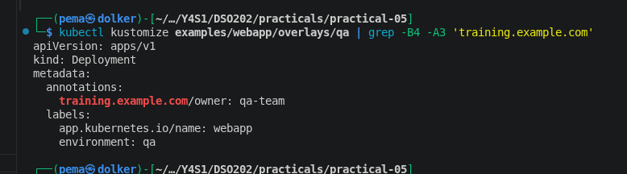

After `kubectl diff -k` (same namespace-not-found error as before) I ran `kubectl apply -k`, which created four objects, including `web-content-4cbfkkb8f2`. My first `grep` on the live Deployment also matched the long `kubectl.kubernetes.io/last-applied-configuration` annotation, so I used `jsonpath` for a cleaner check.

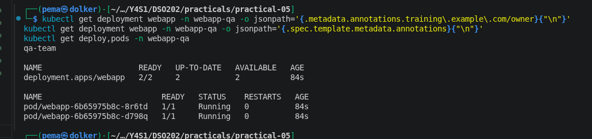

The live Deployment has `training.example.com/owner: qa-team`, and `spec.template.metadata.annotations` is empty, so the annotation is on the Deployment and not on the pods. The Deployment is 2/2 and has two running pods.

### Task 10: Cleanup

I deleted the four environments with `kubectl delete -k` for dev, staging, prod and qa, and then checked what was left.

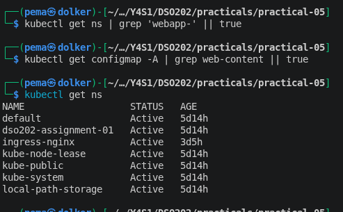

There is no `webapp-*` namespace and no `web-content` ConfigMap left on the cluster. The other namespaces are still there.

### Evidence index

| Evidence asked in the lab | File |
|---|---|
| Repository tree | `evidence/task1-tree.png` |
| Rendered dev output excerpt | `evidence/task3-dev-rendered.yaml`, `evidence/task4-diff-apply.png` |
| dev/prod diff excerpt | `evidence/task3-diff.png`, `evidence/task3-dev-vs-prod.diff` |
| `kubectl get all -n webapp-dev` | `evidence/task4-verify.png` |
| ConfigMap names before and after | `evidence/task6-before.png`, `evidence/task6-after.png` |
| Pod names before and after | `evidence/task6-before.png`, `evidence/task6-after.png` |
| QA overlay files | `examples/webapp/overlays/qa/`, `evidence/task9-qa-files.png` |
| Strategic merge vs JSON 6902 | section 4 |
| Reflection | section 5 |


## Challenge Extension: namePrefix in a sandbox overlay

I created `overlays/sandbox/`, using only the base and `namePrefix: sandbox-`,
with nothing else added:

    resources:
      - ../../base
    namePrefix: sandbox-

Before rendering, I predicted which names would change  and it did change accordingly.

I then ran `kubectl kustomize examples/webapp/overlays/sandbox` and compared
it with my prediction:

    ConfigMap name:            web-content-692t5kf7dh  → sandbox-web-content-692t5kf7dh
    Service name:               webapp                  → sandbox-webapp
    Deployment name:            webapp                  → sandbox-webapp
    volumes[].configMap.name:   web-content-692t5kf7dh  → sandbox-web-content-692t5kf7dh
    volumeMounts[].name:        web-content             → web-content   (unchanged)
    volumes[].name:             web-content             → web-content   (unchanged)


The pattern I found is that `namePrefix` renames an object's own name, and
Kustomize also rewrites any field elsewhere in the output that references
that object by name - the same reference-aware behaviour I saw with the
ConfigMap hash in Task 6. It does not touch `volumeMounts[].name` or
`volumes[].name`, because those are not names of Kubernetes objects; they are
local keys used only to link a mount to a volume inside one Pod spec, so
there is nothing outside that Pod spec for Kustomize to keep in sync.


## 4. Analysis

### Task 1 questions

**Which files exist only once for all environments?**
The Deployment and the Service exist once, in `base/deployment.yaml` and `base/service.yaml`. The base `kustomization.yaml`, which lists them and adds the `app.kubernetes.io/name` label, is also written once. `base/index.html` is only a default page, because every overlay has its own `index.html` that replaces it.

**Which values differ between environments?**
The namespace, the `environment` label, the number of replicas and the text of the web page are different in every environment. Prod also has a different image tag and higher CPU and memory values.

**Where are those differences represented?**
Each overlay has a `kustomization.yaml` with the namespace, the label and the replicas (and the image tag in prod). `namespace.yaml` creates the Namespace object, `index.html` holds the page text, and `overlays/prod/patch-resources.yaml` holds the prod resources.

### Task 2 checkpoint: why the ConfigMap name is not `web-content`

Kustomize adds a suffix to the name of a generated ConfigMap. The suffix (`692t5kf7dh` in my output) is a hash of the content of the ConfigMap, so the name changes whenever the data changes. In `deployment.yaml` I only wrote `web-content`, and Kustomize rewrote the `configMap.name` field in the rendered output to the hashed name, so the Deployment still points to the right ConfigMap.

This also explains the four `grep` lines. Two of them have the hash: the ConfigMap's own name and the Deployment's `configMap.name`, which are the two places that point to the ConfigMap object. The other two are the volume name and the `volumeMounts` name. They only have to match each other inside the pod spec, so Kustomize left them alone.

### Why the overlays are useful (Task 3)

To explain the six differences between dev and prod I only had to read the two small `kustomization.yaml` files, the two `index.html` files and one patch file. Without overlays I would have compared two complete Deployment files line by line, and any change to the base would have to be repeated in both.

### The ConfigMap chain (Task 6)

1. **The file content changed.** I edited the heading in `overlays/dev/index.html` to `DEV v2 — configuration changed`.
2. **The generated ConfigMap content changed.** The ConfigMap is generated from that file, so its data was different. `kubectl apply` printed `configmap/web-content-844tgb64hf created`, a new object and not `configured`.
3. **The hash in the name changed.** The hash depends on the content, so the name went from `web-content-2ttg7dbdck` to `web-content-844tgb64hf`. I saw this in the render before applying, and again in `kubectl get configmap`.
4. **The Deployment reference changed.** Kustomize rewrote `volumes[].configMap.name` to the new name. In the apply output only the Deployment was `configured`, while the Namespace and the Service were `unchanged`.
5. **The pod template changed.** The volume reference is part of the pod template, so the template was different, and the Deployment created a new ReplicaSet (`webapp-56c5f6d9f`) next to the old one (`webapp-5f6ff97d7d`).
6. **A rollout occurred.** The new ReplicaSet went to 1 pod and the old one to 0. The pod changed from `webapp-5f6ff97d7d-cdxw2` to `webapp-56c5f6d9f-zzk94`, and `rollout status` printed `1 old replicas are pending termination` before it finished.

If the ConfigMap name did not change with the content, the pod template would stay identical and the Deployment would not roll out anything. An app that only reads its config at startup would keep using the old values. The old ConfigMap `web-content-2ttg7dbdck` was still in the namespace after the apply, because `apply -k` does not delete it.

### Task 8 questions

**Were the base resource values deleted entirely or merged?**
They were merged. The patch only mentions `resources` of the container named `webapp`, but the rendered container still has its image, ports and volumeMounts. Kustomize found the container by its name and changed only the fields in the patch. The four base values (requests 50m / 64Mi, limits 100m / 128Mi) were replaced because my patch sets all four. I also tried a patch with only `limits` in a scratch copy, and the render kept the base requests (50m / 64Mi) next to the new limits.

**Which environment owns the production-specific resource policy?**
The prod overlay, in `overlays/prod/patch-resources.yaml`. The base only has small defaults, and dev and staging have no resources patch, so they use those defaults.

**Why is a patch better than copying `deployment.yaml` into `prod/`?**
If the whole Deployment was copied into `prod/`, every later change to the base (a readiness probe, for example) would have to be copied by hand, and if I forgot it prod would slowly drift away from the other environments. With the patch, prod still takes everything from the base and the patch only overrides the four resource values, so a new probe in the base would appear in prod automatically. The patch is also short, so a reviewer sees the production policy at a glance.

### Strategic merge vs JSON 6902

Both kinds go in the same `patches:` field.

A strategic merge patch is written like a normal Kubernetes resource (`apiVersion`, `kind`, `metadata.name` and only the fields to change). Kustomize finds the target from those fields and merges the patch into it. Lists like `containers` are merged by `name`, which is why my prod patch only had to name the container `webapp`. I used this style for the prod resources, and it reads like the Deployment itself.

A JSON 6902 patch is a list of operations (`add`, `replace`, `remove`), each with a `path` that points to an exact place and, for add and replace, a `value`. The file does not say which resource it belongs to, so `kustomization.yaml` needs a `target:` with the kind and name next to the `path:`. I used this style for the QA annotation: `op: add`, path `/metadata/annotations/training.example.com~1owner`, value `qa-team`. The annotation key contains a `/`, and in a JSON pointer `/` separates the levels, so inside the key it must be written as `~1`. The base Deployment has no annotations at all, and the patch still worked, because Kustomize created the missing `annotations` map.

I put the annotation on the Deployment (`/metadata/annotations`) and not on the pod template. The live check confirms it: the Deployment shows `qa-team` and `spec.template.metadata.annotations` is empty. An annotation under `spec/template` would have changed the pod template and started a rollout.

For adding one annotation a strategic merge patch would also have worked, and the lesson table says either style is fine for this case. I used JSON 6902 because the lab asked for it. It is the better choice when I need something a merge cannot say clearly, like removing one exact field or changing one exact position in a list.

## 5. Reflection

**What was difficult.** At the start I did not understand why `base/deployment.yaml` and `base/service.yaml` have empty selectors (`matchLabels: {}` and `selector: {}`), because a selector like that cannot work in Kubernetes. Reading the files did not help me, but the render did: the `labels:` block in the base `kustomization.yaml` with `includeSelectors: true` fills the same label into the Deployment selector, the pod template and the Service selector. After that the `includeSelectors: false` in the overlays also made sense, because the `environment` label should not become part of a selector.

**An error I met.** After cleaning up the evidence folder I was still inside `evidence/`, and I ran `kubectl kustomize examples/webapp/overlays/dev | grep 'name: web-content'`. It failed with:

```text
error: must build at directory: not a valid directory: evalsymlink failure on 'examples/webapp/overlays/dev' : lstat /home/pema/Desktop/Y4S1/DSO202/practicals/practical-05/evidence/examples: no such file or directory
```

This was not a mistake in a kustomization file. It was a working directory mistake, but it taught me that the directory I give to `kustomize` or `-k` is relative to where I run the command. The error message helped, because it printed the full path it tried and the path ended with `evidence/examples`. That showed me that I was in the wrong folder, and `cd ..` fixed it. I now check `pwd` when a path error comes up.

**What I would do differently.** I would stay in the repository root the whole time, and I would name every screenshot as soon as I take it. The first ones were saved as `image.png` and I had to rename them afterwards to match them with the tasks.

**What is still unclear.** After the edit in Task 6 the namespace had two `web-content-*` ConfigMaps, the old one and the new one. Deleting the namespace at the end removed both, but I am not sure how the old generated ConfigMaps are normally cleaned up in a namespace that stays alive for a long time, and I did not test any option for it.

## 6. References

1. sarojsanyasi, "03-kind-hands-on-lab: Practical, Environment-Specific Configuration with Kustomize on Kind", HackMD. Accessed 28 September 2026.
2. sarojsanyasi, "01-kustomize-concepts: Kustomize, Concepts That Must Stick", HackMD. Accessed 28 September 2026.
3. sarojsanyasi, "02-patches-and-generators: Kustomize, Patches and Generators Deep Dive", HackMD. Accessed 28 September 2026.
4. DSO202 Practical 1 and Practical 2 guides, used for the repository layout and the report structure. Accessed 28 September 2026.